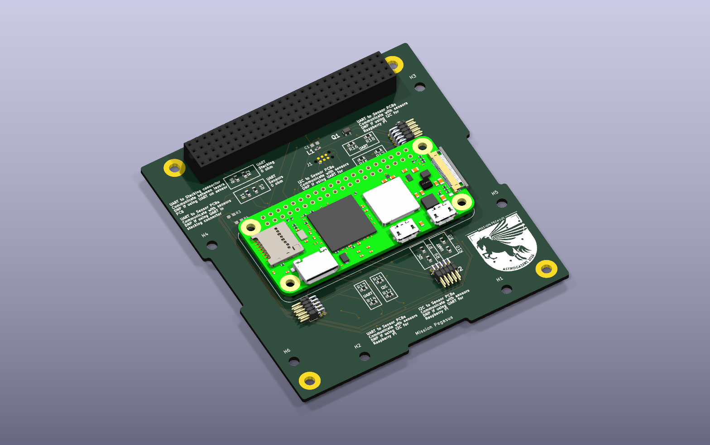
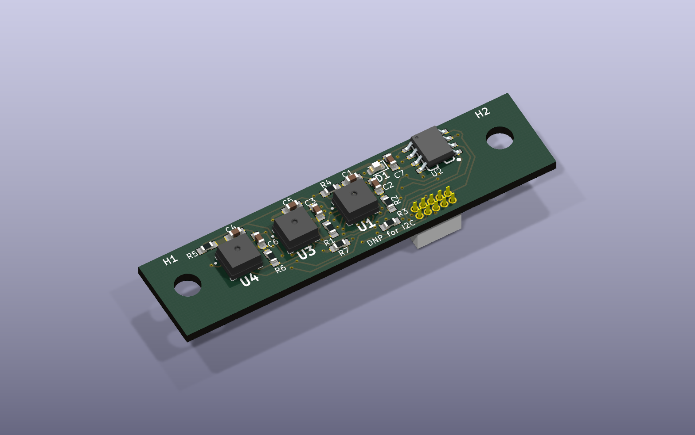

# Mission Pegasus


PCB and mechanical design files for Mission Pegasus: a Raspberry Pi Zero carrier
and an AMS AS7265x spectral sensor board, designed to mate at 90°. The repository
includes schematics, PCB layouts, custom component libraries, mechanical CAD,
modal-analysis project files, and bills of materials.

## PDF schematics

Browse the current schematics without installing KiCad:

- [Main-board schematic (PDF)](output/pdf/main-board-schematic.pdf) - Raspberry Pi, stack interface, programming, and sensor connectors.
- [Sensor-board schematic (PDF)](output/pdf/sensor-board-schematic.pdf) - AS7265x sensors, flash, and board connector.

These are vector PDF exports of the current board schematics. Zoom in for pin
labels and component values. Regenerate the PDFs whenever the source schematics change.

## 3D CAD previews

These views are rendered from the KiCad PCB files and their associated 3D models.

### Main board



[Open the main-board project](main-board/Mission%20Pegasus.kicad_pro).

### Sensor board



[Open the sensor-board project](mezzanine-board/sensorPCB.kicad_pro).
For the mechanical assembly, see the [STEP export](CAD/PCBAssemblyFEA.stp)
and [Inventor CAD files](CAD/).

## Current design and status

The current design is on **[`main`](https://github.com/Periksson1/missionpegasusPCB/tree/main)**.
This is the default branch shown when you open the repository on GitHub.

Both boards have KiCad schematics and PCB layouts. CAD assemblies and an ANSYS
modal-analysis project are included. Manufacturing, assembly, electrical test,
and analysis pass/fail results are **not documented here yet**; the presence of
these files does not establish that the hardware has been validated.

## Getting started

1. Install **KiCad 10.0 or newer**. Both PCB files were saved with KiCad 10.0.
2. Clone the current design:

   ```sh
   git clone --branch main https://github.com/Periksson1/missionpegasusPCB.git
   cd missionpegasusPCB
   ```

3. Open `main-board/Mission Pegasus.kicad_pro` or
   `mezzanine-board/sensorPCB.kicad_pro` in KiCad's project manager.
4. Keep the project folders and their `libraries/` directories together. Custom
   library tables use `${KIPRJMOD}` paths; standard KiCad libraries are also needed.

For mechanical work, `.iam` and `.ipt` files are Autodesk Inventor assemblies and
parts. STEP (`.step` / `.stp`) exports are supplied for compatible CAD viewers.
`Analysis/ModalAnalysis.wbpj` is an ANSYS Workbench project; retain its adjacent
`ModalAnalysis_files/` directory. Exact Inventor and ANSYS application requirements
have not been documented.

## Boards

| Project | Description | Documentation |
|---|---|---|
| [Main board](main-board/Mission%20Pegasus.kicad_pro) | Raspberry Pi Zero carrier and stack interface | [Main-board README](main-board/README.md) |
| [Mezzanine board](mezzanine-board/sensorPCB.kicad_pro) | Spectral sensor daughterboard for the perpendicular assembly | [Mezzanine README](mezzanine-board/README.md) |

## Repository layout

| Path | Contents |
|---|---|
| `main-board/` | Main-board KiCad project, local libraries, documentation, BOMs, and CAD exports |
| `mezzanine-board/` | Sensor-board KiCad project, local libraries, BOMs, and CAD exports |
| `CAD/` | Mechanical assemblies, bracket parts, and assembly STEP export |
| `Analysis/` | ANSYS Workbench modal-analysis project and supporting files |
| `Combined BOM.xlsx` | Combined bill of materials |
| `Peter's Files/` | Additional copies of board projects, CAD, BOMs, and vendor software; use the top-level board folders for the documented workflow |
| `vendor/` | Third-party AMS dashboard software, firmware, and FTDI driver files |
| `MEZZANINE_INTERFACE.md` | Draft connector/interface planning notes with incomplete pin assignments |

The relationship and revision differences between `Peter's Files/` and the
top-level projects have not been reconciled in this documentation.

## BOMs and design references

- [Combined BOM](Combined%20BOM.xlsx)
- [Main-board BOM](main-board/Mission%20PegasusBOM.csv)
- [Sensor-board BOM](mezzanine-board/sensorPCBBOM.csv)
- [Component notes](main-board/docs/Components.docx) and [datasheets](main-board/docs/datasheets/)
- [Stack-interface schematic](main-board/StackInterface.kicad_sch)
- [Draft mezzanine interface](MEZZANINE_INTERFACE.md)
- [Mechanical assembly STEP export](CAD/PCBAssemblyFEA.stp)

BOMs and CAD exports are saved snapshots. Check them against the chosen board
revision before ordering parts or manufacturing. The interface document still
contains `TBD` pins; use the current schematics and verify connector numbering
and mechanical orientation before connecting hardware.

## Editing the designs

The main-board schematic contains cached versions of `AS72652`, `AS72653`, and
`RASPBERRY_PI_ZERO_2_W`. As noted in the [main-board documentation](main-board/README.md),
the corresponding library copies are older/incomplete. **Do not run
Tools → Update Symbols from Library on these parts** without first reconciling
the library definitions with the schematic.

When preparing a hardware revision, record its ERC/DRC results, fabrication
revision, assembly status, and test results alongside the design so readers can
distinguish design work from validated hardware.

